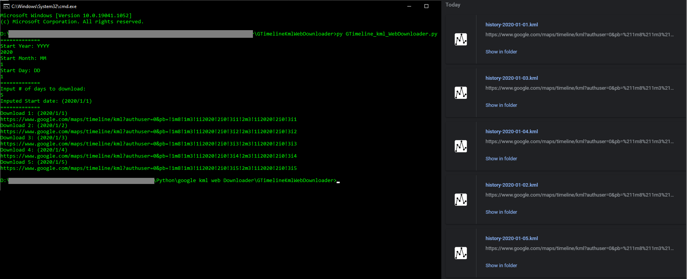

# GTimelineKmlWebDownloader
Simple Script to download all the individual days kml files from google timeline web interface. Just Set start date, and number of days to download!

## why?
* Google take out only gives you Json files, or ONE big KML file with ALL your raw data. It also strips out all the nice Waypoint labels and all the nice tracks infomation like "Running" or "Driving". When you Export a single day from the Web interface, it leaves all that data intacted, BUT you can only download one day at a time. 

## To Run
1. Download and run "GTimeline_kml_WebDownloader.py" file (you need python3 installed)
2. Make sure you are logged into your main google account on your defult web browser ans user "0" (what ever account you logged into first)
3. Enter Year:YYYY, Month:MM, Day:DD as prompted. 
4. Input how many days you want. (good idea just to test it out with a few days first)
5. Hit enter, and it should download your days from google timeline.
6. The downloads will go to your download folder, or where ever your browsers download folder is.

## Tips
* I downloaded 356 days in each go, went through and did each year that way. Running on chrome, things slowed down a lot, but it worked. About 15mins of work and got the last 8 years of days all in there individual kml files.

* I used software called "GPXSee" to visualize it locally on my own machine, its also able to pull in some or all your days and show them all on the map at once.